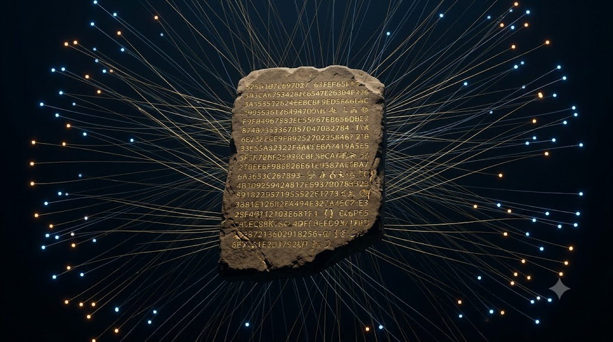

# Haawke Hash



**Cryptographic provenance for human-AI collaborative works.**

A browser-based SHA-256 hashing and blockchain timestamping tool built by Craig Ellenwood × Claude (Anthropic). Every hash is registered to a public Cloudflare KV registry and optionally timestamped to the Bitcoin blockchain via OpenTimestamps.

Live: [hash.haawke.com](https://hash.haawke.com)  
Registry: [verify.haawke.com](https://verify.haawke.com)  
ORCID: [0009-0001-6475-5109](https://orcid.org/0009-0001-6475-5109)

---

## What It Does

- SHA-256 hash any file, text, or URL
- Register the hash to a public provenance registry (Cloudflare KV)
- Timestamp to the Bitcoin blockchain via OpenTimestamps
- Download a `.ots` cryptographic proof certificate
- Self-verifying badge shows live verification status on any page
- Export a local provenance log as JSON

## How To Use

1. Drop a file, paste text, or enter a URL
2. Click **Generate Hash**
3. Click **Save to Provenance Log** — registers to public registry
4. Click **Timestamp to Blockchain** — downloads `.ots` proof file
5. Copy the footer embed for your page

Full workflow documented at [hash.haawke.com](https://hash.haawke.com)

---

## Self-Verifying Badge

Embed in any page to display live verification status:

```html
<div id="haawke-badge" data-date="June 5, 2026" data-author="Craig Ellenwood × Claude (Anthropic)"></div>
```

The badge fetches `provenance.json` from the same directory and re-hashes the live page on every load. Gold = verified. Red = content changed.

---

## Files

| File | Purpose |
|------|---------|
| `index.html` | The tool — runs entirely in browser |
| `background.jpg` | AI-generated background — certified June 5, 2026 |
| `provenance.json` | Stores the certified SHA-256 hash of index.html |
| `provenance/*.ots` | OpenTimestamps blockchain proof files |

---

## Infrastructure

- **Frontend:** Netlify → hash.haawke.com
- **Registry + OTS Proxy:** Cloudflare Worker → verify.haawke.com
- **Blockchain:** Bitcoin via OpenTimestamps
- **No server. No database. No tracking.**

---

## Provenance

This tool is itself certified. The SHA-256 hash of `index.html` is stored in `provenance.json` and registered to the public Cloudflare KV registry. The Bitcoin blockchain timestamp is in `provenance/index.html.ots`.

---

## License

Creative Commons Attribution-NonCommercial 4.0 International (CC BY-NC 4.0)  
See [LICENSE](LICENSE)

---
Citations if you find this of use, are appreciated: 
Ellenwood, Craig. & Claude (Anthropic). (2026). Haawke Hash: 
Cryptographic Provenance for Human-AI Collaborative Works 
(v1.0). Haawke Neural Technology. 
https://hash.haawke.com
ORCID: 0009-0001-6475-5109
SHA-256: [hash]

---

*Craig Ellenwood × Claude (Anthropic) · Haawke Neural Technology · 2026*  
*ORCID: 0009-0001-6475-5109 · haawke.com*
